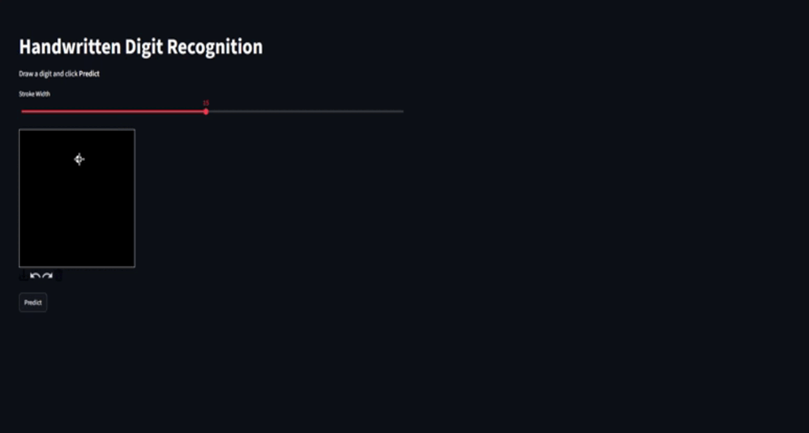
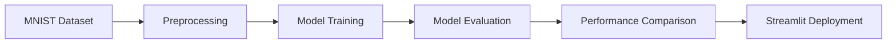
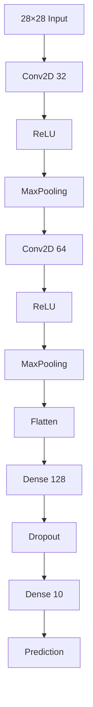
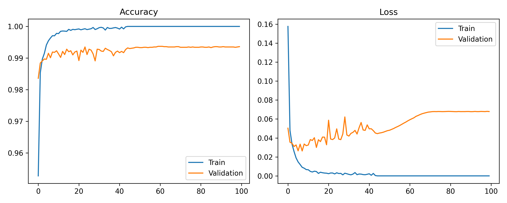
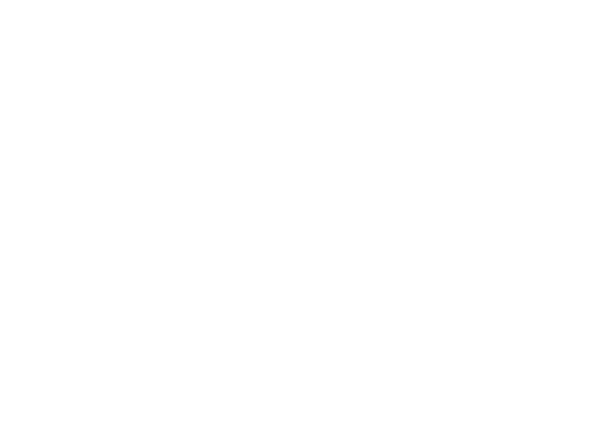
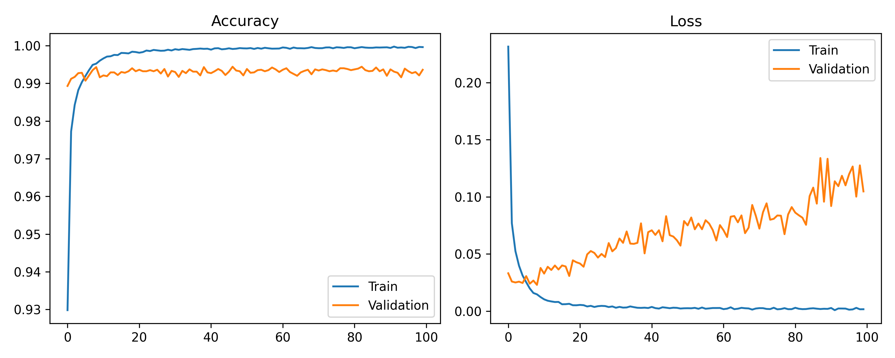

# Handwritten Digit Recognition using Convolutional Neural Networks

<p align="center">
    
</p>

A handwritten digit recognition project using Convolutional Neural Networks (CNN), developed as part of my **Introduction to Artificial Intelligence** course.

The project compares three different CNN training strategies to improve prediction performance on handwritten digits and deploys the best-performing model as an interactive Streamlit application.

---

# Introduction

Handwritten digit recognition is a classic computer vision problem widely used in Optical Character Recognition (OCR). Although the MNIST dataset is relatively simple, models trained only on the original dataset often struggle when predicting handwritten digits with different writing styles or orientations.

This project explores three different training strategies to improve the model's robustness:

- Original CNN
- CNN with ImageDataGenerator
- CNN with ImageDataGenerator and custom OpenCV augmentation

The final model is deployed using Streamlit, allowing users to draw handwritten digits and receive real-time predictions.

---

# Demo

<p align="center">
    
</p>

The application supports:

- Drawing handwritten digits
- Real-time prediction
- Confidence score
- Probability distribution
- Inference time measurement

---

# Dataset

Dataset: **MNIST**

- 60,000 training images
- 10,000 testing images
- Image size: 28 × 28
- Grayscale
- Classes: 0–9

---

# Method



---

# CNN Architecture



Training configuration

- Optimizer: Adam
- Loss: Categorical Crossentropy
- Activation: ReLU
- Output Activation: Softmax

---

# Training Strategies

| Version | Description |
|----------|-------------|
| **V1** | Original CNN trained on normalized MNIST images. |
| **V2** | CNN combined with ImageDataGenerator to perform online image augmentation, including random rotation, zoom, width shift and height shift. |
| **V3** | Extends Version 2 by applying additional OpenCV transformations such as rotation, translation and scaling, improving robustness on real handwritten digits. |

## Data Augmentation Comparison

| Original | Version 2 | Version 3 |
|-----------|-----------|-----------|
| *(Paste image)* | *(Paste image)* | *(Paste image)* |

---

# Training Results

## Training History

| Version 1 | Version 2 | Version 3 |
|------------|------------|------------|
|  |  |  |

---

## Training Metrics

| Version | Metrics |
|----------|---------|
| V1 | *(Paste Accuracy / Precision / Recall / F1-score)* |
| V2 | *(Paste Accuracy / Precision / Recall / F1-score)* |
| V3 | *(Paste Accuracy / Precision / Recall / F1-score)* |

---

# Model Comparison

The following example uses the same rotated handwritten digit for all three trained models.

| Input | Version 1 | Version 2 | Version 3 |
|-------|------------|------------|------------|
| *(Paste Input Image)* | *(Paste Screenshot)* | *(Paste Screenshot)* | *(Paste Screenshot)* |
| Prediction | ❌ Incorrect | ✅ Correct | ✅ Correct |
| Confidence | xx.xx% | xx.xx% | **99.xx%** |

### Observation

- **Version 1** is trained using only the original MNIST dataset and struggles with rotated handwritten digits.
- **Version 2** improves prediction accuracy through online augmentation but still produces lower confidence.
- **Version 3** achieves the highest confidence by combining ImageDataGenerator with custom OpenCV transformations, allowing the model to generalize better to real handwritten inputs.

---

# Project Structure

```text
Handwritten-Digit-Recognition
│
├── Model_Training/
│   └── Main_Model.ipynb
│
├── model/
│   ├── handwritten.h5
│   ├── handwritten_v2.h5
│   └── handwritten_v3.h5
│
├── prediction/
│
├── results/
│   ├── demo.gif
│   ├── train_v1_history.png
│   ├── train_v2_history.png
│   ├── train_v3_history.png
│   └── training_result.png
│
├── App.py
├── train.py
├── train_v2.py
├── train_v3.py
├── utils.py
├── requirements.txt
└── README.md
```

---

# Installation

Clone the repository

```bash
git clone https://github.com/<your-username>/Handwritten-Digit-Recognition.git

cd Handwritten-Digit-Recognition
```

Install dependencies

```bash
pip install -r requirements.txt
```

---

# Usage

## Train Version 1

```bash
python train.py
```

## Train Version 2

```bash
python train_v2.py
```

## Train Version 3

```bash
python train_v3.py
```

Run the Streamlit application

```bash
streamlit run App.py
```

Open

```
http://localhost:8501
```

Draw a handwritten digit and click **Predict**.

---

# Future Improvements

- ResNet
- EfficientNet
- Vision Transformer
- EMNIST Dataset
- ONNX Runtime
- TensorRT Deployment

---

# Author

**Dat Tran Minh**

Computer Science Student

GitHub: https://github.com/<your-username>